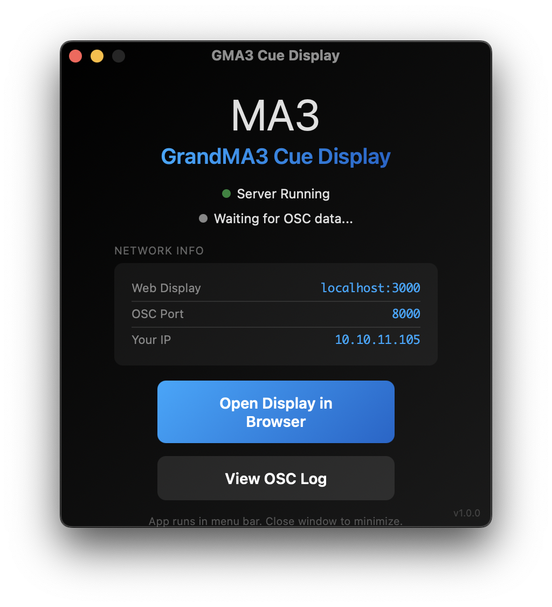

# GrandMA3 Cue Display

A macOS menu bar app that displays your current GrandMA3 cue in a web browser.




## What It Does

This app runs quietly in your macOS menu bar and serves a **web-based cue display** that shows:
- **Sequence name** on the first line
- **Cue number and name** on the second line

The launcher window shows the display URL and your network IP for easy access from any device.

## Features

- **Web-based display** - View cues in any browser on any device on your network
- **Menu bar app** - Runs silently in your macOS menu bar
- **OSC communication** - Receives cue data from GrandMA3 via UDP
- **OSC log viewer** - Debug incoming OSC messages at `/osc-log`

## Quick Start (macOS)

1. **Download** the DMG from Releases (or build from source)
2. **Install** by dragging "GMA3 Cue Display" to Applications
3. **Fix macOS security warning** - Since the app isn't signed with an Apple Developer certificate, macOS may show a "damaged" error. Run this command in Terminal:
   ```bash
   xattr -cr /Applications/GMA3\ Cue\ Display.app
   ```
4. **Launch** the app - it appears in your menu bar
5. **Open** the cue display in your browser from the launcher window

The launcher window shows:
- Display URL to open in any browser
- OSC port for GrandMA3 configuration
- Connection status indicator

## GrandMA3 Configuration

### Step 1: Open OSC Settings
1. Press **Menu**
2. Navigate to **In & Out**
3. Select **OSC**

### Step 2: Configure OSC Output
1. **Enable Output**: Toggle ON
2. **Destination IP**: Enter the IP address of the computer running this app
3. **Port**: Set to `8000`
4. **Mode**: UDP

### Step 3: Enable Send Options
In the OSC configuration grid, set **Send** to **Yes** for the rows you want to monitor.

### Step 4: Verify Connection
When a cue is triggered on the console, you should see the cue name update in real-time on the web display.

## Ports

| Port | Protocol | Description |
|------|----------|-------------|
| 3000 | HTTP/WebSocket | Web display server |
| 8000 | UDP | OSC input from GrandMA3 |

## Project Structure

```
MA3 Cue Display/
├── gma3-cue-display-tauri/     # Tauri menu bar app
│   ├── src-tauri/
│   │   ├── src/lib.rs          # Main Rust code (server + OSC)
│   │   ├── Cargo.toml          # Rust dependencies
│   │   └── tauri.conf.json     # Tauri configuration
│   └── src/
│       ├── index.html          # Launcher window UI
│       ├── web-display.html    # Web cue display (served to browsers)
│       └── osc-log.html        # OSC message log viewer
└── README.md
```

## Network Architecture

```
┌─────────────────┐         OSC (UDP)          ┌─────────────────┐
│   GrandMA3      │ ────────────────────────▶  │   Menu Bar App  │
│   Console       │        Port 8000           │     (Tauri)     │
└─────────────────┘                            └────────┬────────┘
                                                        │
                                                        │ WebSocket
                                                        │ Port 3000
                                               ┌────────▼────────┐
                                               │   Web Browser   │
                                               │  (Cue Display)  │
                                               └─────────────────┘
```

Open `http://<your-ip>:3000` in any browser to view the cue display.

## API Reference

### GET /api/state

Returns the current state as JSON:

```json
{
  "sequenceName": "Seq 7",
  "cueNumber": "3.5",
  "cueName": "Song 1 - Chorus",
  "progress": 100,
  "isActive": true,
  "lastUpdate": "2024-01-15T20:30:00.000Z",
  "connected": true
}
```

### WebSocket

Connect to the server's WebSocket endpoint to receive real-time updates. Messages are JSON with a `type` field:

- `state` - Initial state on connection
- `cueUpdate` - Cue information has changed
- `oscLog` - New OSC message received (for log viewers)

### GET /api/osc-log

Returns the last 100 OSC messages as a JSON array.

## Building from Source

Requires [Rust](https://rustup.rs/) and [Tauri CLI](https://tauri.app/):

```bash
cd gma3-cue-display-tauri
cargo tauri build
```

The built app will be in `src-tauri/target/release/bundle/`.

## License

MIT License - see [LICENSE](LICENSE) for details.
